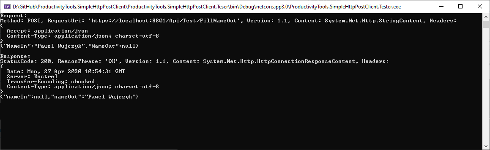

<!--Category:C#--> 
 <p align="right">
    <a href="https://www.nuget.org/packages/ProductivityTools.SimpleHttpPostClient/"></a>
    <a href="http://www.productivitytools.tech/sql-commands/"><a> 
    <a href="https://github.com/pwujczyk/ProductivityTools.SimpleHttpPostClient"></a>
</p>
<p align="center">
    <a href="https://www.powershellgallery.com/packages/ProductivityTools.PSSetLockScreen/">
        
    </a>
</p>

# SimpleHttpPostClient

Nuget contains wrapper on HttpClient which allows to simply call the endpoint with POST method. It basic capabilities are limited but it helps to call the json endpoint with minimum effort.


Generic parameter (here string) is the type of result we are expecting to receive. 
First parameter is controller, second parameter is action on controller. 

So as the result of this code. Call to **https://localhost:8801/Api/Test/Index** will be performed and we expect that it will return string.

```
HttpPostClient client = new HttpPostClient();
client.SetBaseUrl("https://localhost:8801/Api");

var result1 = client.PostAsync<string>("Test", "Index");
```

In third parameter we can post any object to API. It will be serialized to json and sent to given endpoint
```
ComplexObject complex = new ComplexObject();
var result2 = client.PostAsync<ComplexObject>("Test", "FillNameOut", complex)
```

## More options usage

If you would like to see what exactly is send during each post, you could create HttpPostClient with parametrized constructor.

```
HttpPostClient client = new HttpPostClient(true);
```
This will send serialized date to the console. 

 

 